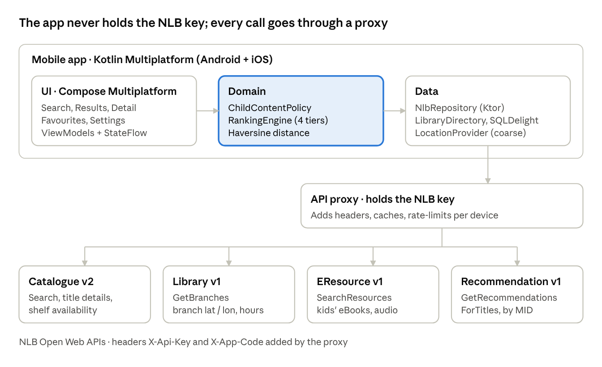

# Hiro-Kids — Mobile App Specification (Android and iOS)

Oct 5, 2026 · @luke woo

## 1. Overview

Hiro-Kids is a mobile app for Android and iOS, built from one Kotlin Multiplatform codebase, that shows what is on the shelf in the NLB library you are standing in. The NLB Mobile app does not show this; Hiro-Kids puts it first. The user searches either children's books or adult books, never both at once, and can switch to another library's results when the book they want is not here. It is built on four NLB Open Web APIs: Catalogue, Library, EResource and Recommendation.

This spec is written for spec-driven development: every requirement has an ID (FR-x, NFR-x), testable acceptance criteria, and maps to tasks in section 8. Implementation (human or coding agent) must not add behaviour that no requirement covers.

**Users**

- Primary: a parent or caregiver physically inside an NLB library, looking for children's books on the shelf now.
- Secondary: an adult in the same library searching adult books for themselves.

**In scope (v1)**

- Detect or choose the library the user is in; all results are for that library.
- A Children / Adult mode switch; results are never mixed.
- Keyword, title, author and ISBN search within the current mode.
- Results led by books on the shelf here, with copy count and call number.
- Other libraries with copies on the shelf, and a View action that switches to that library.
- Book detail with a large call number for this library, then other libraries' shelf counts.
- eBooks and audiobooks from NLB eResources, shown after physical items.
- Favourites and recently viewed, stored on the device; a Settings screen.

**Non-goals (v1)**

- Sign-in, borrowing, renewals or reservations (these need the NLB account and the official NLB Mobile app).
- Mixed children and adult results in one list.
- Travel time or routing between libraries.
- Tablet-optimised layouts beyond what Compose Multiplatform adapts by default.
- Any server-side component other than the API proxy in section 7.

## 2. NLB Open Web API inventory

The app calls eight endpoints across the four APIs. All need an API key from the [Open Web Service Application Form](https://go.gov.sg/nlblabs-form), sent as headers `X-Api-Key` and `X-App-Code`, and NLB's terms limit use to non-commercial purposes ([NLBlabs](https://www.nlb.gov.sg/main/partner-us/contribute-and-create-with-us/NLBLabs)).

**Credentials and limits.** The app code and API key were issued on 6 Oct 2026 and live only in the proxy's secret manager, never in this doc, the repo or either app. The key is valid for 6 months and expires on 6 Apr 2027, so renewal must happen before then. The limit is 1 call per second and 15 calls per minute for the whole key; because every user's calls go through the proxy, all users share it.

| API | Base URL | Endpoint | Used for | Key inputs | Key outputs |
| --- | --- | --- | --- | --- | --- |
| Catalogue v2 | `https://openweb.nlb.gov.sg/api/v2/Catalogue` | `GET /SearchTitles` | Main search | `Keywords`, `IntendedAudiences`, `MaterialTypes`, `Locations`, `Availability`, `Fiction`, `Languages`, `Limit`, `Offset` | `titles[]` (title, author, `coverUrl`, `records[]` with `brn`, `format`, `audience`, `subjects`, `availability`), `facets[]`, `totalRecords`, `nextRecordsOffset` |
| Catalogue v2 | same | `GET /GetTitles` | Field search (title, author, ISBN) | `Title`, `Author`, `Subject`, `ISBN`, `SetId`, `Offset` | `titles[]`, `setId` |
| Catalogue v2 | same | `GET /GetTitleDetails` | Detail screen | `BRN` or `ISBN` | Full record: summary, subjects, `audience`, `language`, `isRestricted`, `activeReservationsCount` |
| Catalogue v2 | same | `GET /GetAvailabilityInfo` | Per-branch shelf status | `BRN` or `ISBN`, `Offset` | `items[]`: `location {code, name}`, `usageLevel`, `transactionStatus`, `callNumber`, `media`, `minAgeLimit` |
| Library v1 | `https://openweb.nlb.gov.sg/api/v1/Library` | `GET /GetBranches` | Branch list with coordinates | `ListType=active`, `LibraryTypes` (PL, RL, NL), `BranchCodes` | `branches[]`: `branchCode`, `branchName`, `address`, `coordinates {geoLatitude, geoLongitude}`, `timing.openingHours`, `closureSchedules` |
| EResource v1 | `https://openweb.nlb.gov.sg/api/v1/EResource` | `GET /SearchResources` | eBooks and audiobooks for the current mode | `ContentType` (required: eBooks, Audio Books), `Keywords`, `Subject`, `ISBN`, `Limit` (max 100), `Offset` | `results[]`: `id`, `title`, `authors`, `subjects`, `isbns`, `coverUrl`, `url` |
| EResource v1 | same | `GET /GetAvailabilityInfo` | eBook loan availability (OverDrive only) | `IdType` (TitleId or ISBN), `Id` | `available`, `totalCopies`, `totalAvailableCopies`, `totalReservationCopies` |
| Recommendation v1 | `https://openweb.nlb.gov.sg/api/v1/Recommendation` | `GET /GetRecommendationsForTitles` | "More like this" | `RecommendationType=book`, `IdType=title`, `Id` (a title MID, not an ISBN), `ReturnMode` | `titles[]`: `id`, `isbn`, `title`, `author`, `publishedYear`, `format` |

All endpoints, parameters and fields above were read from NLB's live [Swagger definitions](https://openweb.nlb.gov.sg/api/swagger/index.html) on 5 Oct 2026; the code lists below come from [NLB's Catalogue code references](https://openweb.nlb.gov.sg/api/References/Catalogue.html).

**Code lists the app depends on**

| List | Values used | Meaning |
| --- | --- | --- |
| IntendedAudiences | `juvenile` (Children mode), `adult` (Adult mode). Live ids from `facets[]` (T0): `juvenile`, `preschool`, `primary`, `pre-adolescent`, `adolescent`, `general`, `adult`. `junior` is rejected with 400 | NLB's audience classification for a title |
| Locations | Lower-case branch code, e.g. `trl` (`GetBranches` returns `TRL`; lower-case it) | Limits `SearchTitles` to one library |
| C004 Usage level | Observed in T0: `JUNIOR PB` (Junior Picture Book), `ELL 0-3` and `ELL 4-6` (Early Literacy), `ATT` (Accompanying Item). `JUNIOR`, `RACL`, `TEEN` and `ADULT` were not seen in the samples; confirm the full list before Task 6 | Which section a physical copy is shelved in |
| C003 Transaction status | `S` Available; `C` On loan; `IH`/`H` Reserved; `I` In transit; `SP` In process; `L` Missing; `T` Trace placed | Shelf state of one copy |
| MaterialTypes | `bks` Book (default); other ids from the `materialType` facet (`ebk`, `dvd`, ...). `BK` is rejected with 400 | Material filter |

## 3. Functional requirements

Requirements use EARS phrasing ("When … the app shall …") so each acceptance criterion becomes one automated test.

| ID | Requirement | Acceptance criteria | APIs |
| --- | --- | --- | --- |
| FR-1 Search | When the user submits a query of 2+ characters, the app shall return titles in the current mode (FR-2) matching keyword, title, author or ISBN. | Query "dinosaur" in Children mode returns ≥ 1 result within 3 s on 4G; a 10- or 13-digit ISBN routes to `GetTitles?ISBN=`. | Catalogue `SearchTitles`, `GetTitles` |
| FR-2 Audience mode | The app shall offer a Children / Adult switch on the search home and search only one audience at a time, per section 4. | Children mode shows only NLB children's material; Adult mode shows only material NLB classifies as adult; no result list mixes the two. The mode is shown in the heading, a tag in the search box, the results header chip, and the search colour (amber Children, blue Adult). | Catalogue |
| FR-3 Current library | When the app opens, it shall set the current library by detecting the library the user is in (the phone's location while the app is in use) or by the user choosing one from a searchable list. | Detection picks the branch whose coordinates are nearest, within 300 m; outside 300 m the picker opens, listing the closest libraries first when a location is available. Detection is a convenience, not a guarantee: the user can tap Change at any time (for example after moving to another library). The current library shows as "You're at {library}" with Change, and persists across restarts. Denying location still allows choosing a library. | Device location (Android, iOS), Library `GetBranches` |
| FR-4 Library-first results | Results shall be grouped, in order: on the shelf here; in this library but all copies out; other libraries with copies on the shelf; read online. | A title with a copy at status `S` in the current library always appears in the first group; titles held only elsewhere never appear above it. | `SearchTitles with Locations and Availability` |
| FR-5 Result card | Each "on the shelf here" card shall show cover, title, author, type, "On the shelf here", plus the copy count and call number when the local book store already has them (otherwise these appear on the book detail). Cards in the "all copies out" group show "On loan here" and how many are waiting. | Copy count excludes copies at other branches; missing cover shows a placeholder; text scales to 200% without clipping. | Catalogue |
| FR-6 Book detail | When a result is tapped, the app shall show an "On the shelf here" panel with "{available} of {total} copies", the call number in large type and the shelf type (from usage level), then summary and subjects. | If no copy is on the shelf here, the panel says so and the other-libraries list moves up. | `GetTitleDetails`, `GetAvailabilityInfo` |
| FR-7 Filters | The app shall offer filters for type of book, language (English, Chinese, Malay, Tamil) and "On the shelf now". Type options follow the mode: Picture books, Junior fiction, Junior non-fiction (Children); Fiction, Non-fiction (Adult). | "On the shelf now" hides titles with no copy at status `S` in the current library. Filters persist for the session. | `SearchTitles` |
| FR-8 eBooks section | After physical results, the app shall show up to 10 eResources for the current mode in a "Read online" section, with loan availability where NLB provides it. | Section never appears above physical results; each item opens its NLB `url` in an in-app browser (Custom Tab on Android, SFSafariViewController on iOS). | EResource `SearchResources`, `GetAvailabilityInfo` |
| FR-9 More like this (KIV) | On the detail screen the app shall show up to 10 recommended titles in the same mode that are on the shelf in the current library. | Recommendations not on the shelf here, or outside the current mode, are dropped. Hidden until a title MID can be obtained (section 9). | Recommendation `GetRecommendationsForTitles`, `GetAvailabilityInfo` |
| FR-10 Favourites | The user shall be able to save and remove titles; the Favourites screen splits them by mode and shows live shelf status for the current library. | Favourites survive app restart; no account needed; each row shows "{n} on shelf here · {call number}" or "All copies out here". | SQLDelight, `GetAvailabilityInfo` |
| FR-11 Paging | When the user scrolls to the end of a group, the app shall load the next 20 results using `nextRecordsOffset`. | No duplicate BRNs across pages; "End of results" shown when `hasMoreRecords = false`. | `SearchTitles` |
| FR-12 Errors and offline | On network failure or HTTP 429/5xx the app shall show a retry action and any stored results. | 429 triggers exponential back-off (1, 2, 4 s, max 3 tries) before the error is shown. | All |
| FR-13 Teen toggle | In Children mode the app shall offer an "Include teen books" toggle in Settings and Filters, off by default. | Off: no teen or youth-only result appears (T9). On: teen titles appear with a "Teen" badge, still never adult, restricted or rated items. Hidden in Adult mode. | `SearchTitles`, multiplatform-settings |
| FR-14 Local book store | The app shall store every title record it receives on the device, keyed by BRN, with no expiry, because book details do not change. Detail screens and repeat results load from this store first; only shelf availability is fetched from the network. | A title seen before opens its details in ≤ 200 ms, including offline, and makes no `GetTitleDetails` call. Availability rows show a loading state until `GetAvailabilityInfo` returns. | SQLDelight, `GetAvailabilityInfo` |
| FR-15 Other libraries | Below the current library's results, the app shall list other libraries that have matching books on the shelf, with the number of books for each (from search facets, one call). On book detail, each other library shows "{available} of {total} on shelf". | Results list: most books on shelf first, then nearest. Book detail: libraries with copies on the shelf before those with none, then nearest. | `GetAvailabilityInfo`, `GetBranches` |
| FR-16 View another library | Tapping View on another library shall switch the current library to it and show that library's results for the same query and mode. | The "You're at" card and results chip show the new library; Back returns to the previous library's results. | — |
| FR-17 Settings | The Settings screen shall offer: library (opens the picker), starting mode (Children or Adult), the teen toggle, clearing stored book details, clearing recently viewed and searches, and an About note crediting NLB. | Each clear action empties only its own store; the About note states the app is not an official NLB app. | multiplatform-settings, SQLDelight |
| FR-18 Recently viewed | The search home shall show up to 10 recently viewed titles for the current mode, stored on the device. | Switching mode switches the list; cleared from Settings. | SQLDelight |

### UI design reference

The screens in the [Hiro-Kids UI Design canvas](https://claude.ai/code/artifact/e20d3fcd-420a-4984-b97a-02ccf461c1a8) are the visual reference for the build: layout, order of sections, copy, colours and touch targets follow the design, and behaviour follows this spec. Where they disagree, raise it rather than guess. A copy of the screen sources is kept in the repo at `docs/design/` (one `.dc.html` file per screen; open the canvas to click through them with Play). Titles, authors, counts and call numbers on the screens are sample data.

| # | Screen | Design file | Requirements | What the build must match |
| --- | --- | --- | --- | --- |
| 1 | Search home | `Main.dc.html` | FR-1, FR-2, FR-3, FR-7, FR-18 | "You're at {library}" card with Change; mode heading; "Searching for" switch with Children's books / Adult books; search box with mode tag and mode colour; quick filter chips per mode; Recently viewed row; bottom bar Search / Favourites / Settings |
| 2 | Results | `Results.dc.html` | FR-4, FR-5, FR-8, FR-11, FR-15, FR-16 | Header with query, mode chip, library chip, Filters button; groups in order: On the shelf here (count line), In this library but all copies out, dashed "More on the shelf at other libraries" box with View per library, Read online |
| 3 | Book detail | `Detail.dc.html` | FR-6, FR-9, FR-10, FR-15, FR-16 | Cover header with Back and Save; green "On the shelf here" panel with copies, large call number and shelf type; At other libraries with "{available} of {total} on shelf", View and directions; About this book; More like this, on the shelf here |
| 4 | Which library are you at? | `Location.dc.html` | FR-3 | "Detect the library I'm in" button; searchable library list with tick on the chosen one; confirm button "I'm at {library}" |
| 5 | Filters | `Filters.dc.html` | FR-7, FR-13 | Type of book chips (per mode), Language chips, On the shelf now switch, Include teen books switch (Children mode only); Clear all and Show books |
| 6 | Favourites | `Favourites.dc.html` | FR-10 | Library chip; Children's / Adult split with counts; rows with shelf status here and remove button; "saved on this phone" note |
| 7 | Settings | `Settings.dc.html` | FR-17, FR-13 | Search group (Library, Start in, Include teen books); Stored on this phone group (two Clear actions); About note |

**Design tokens** (taken from the design; use these, not platform defaults)

| Token | Value | Used for |
| --- | --- | --- |
| Heading font | Fredoka 600 | Titles, section headings, book titles |
| Body font | Nunito Sans 400–800 | All other text |
| Ink | `#14213D` | Main text, dark chips |
| Secondary text | `#3D4555`, `#4A5568` | Labels, captions |
| Primary / Adult mode | `#2B59C3` (pressed `#1E3F8F`, tint `#E6EDFB`) | Buttons, links, Adult mode switch and search box |
| Children mode | `#B4530A` (ink `#7A3606`, tint `#FFEAD2`) | Children mode switch, search box, tag |
| On the shelf | background `#DDF3EA`, text `#0B5D45` | "On shelf" badges and the detail panel |
| On loan / out | background `#FDEBD3`, text `#8A4100` | "On loan" and "all copies out" badges |
| Logo / book header | `#FFC94A` / `#FFF4D6` | App mark, detail header background |
| Surfaces | page `#F5F7FB`, card `#FFFFFF`, border `#E3E7EE`, input border `#C9D3E3` | Backgrounds and outlines |
| Shape | cards 16 px radius, chips fully rounded, screen 390 × 844 reference | Layout |
| Touch targets | ≥ 44 pt (iOS) / 48 dp (Android); design uses 44–56 px | All controls (NFR-8) |

Status is never shown by colour alone: every green or amber badge also carries its words ("On shelf", "On loan").

## 4. Audience modes and content filtering

The app runs in exactly one mode at a time, Children or Adult, and each mode shows only what NLB itself classifies for that audience. Filtering runs in two layers: the API query asks only for that audience, and a client-side gate (`AudiencePolicy`) re-checks every record before it is shown; anything ambiguous is hidden.

| Check | Children mode | Adult mode |
| --- | --- | --- |
| Layer 1: `IntendedAudiences` | `juvenile`; plus `adolescent` (and `pre-adolescent`) when FR-13 is on | `adult` |
| Layer 2: audience fields | `audience` / `audienceImda` has a children's marker, or `subjects` contain "Juvenile" | No children's or juvenile marker |
| Layer 2: copies listed (usage level) | `JUNIOR`, `JUNIOR PB`, `RACL`; plus `TEEN` when FR-13 is on | `ADULT` only |
| Layer 2: other rules | `isRestricted` false; `minAgeLimit` absent or 0; no rated media (M18, NC16, R21) | None beyond NLB's adult classification |
| eResources | Shown only when the subject is in NLB's children's subject list | Shown only when the subject is not in the children's list |

- `MaterialTypes=bks` by default in both modes.
- Field searches via `GetTitles`, which has no audience parameter, go straight to Layer 2.
- A title with both junior and adult copies appears in each mode, but only that mode's copies are counted and listed.

**Filter mapping (FR-7)**

| Filter | Mode | API parameters | Client rule |
| --- | --- | --- | --- |
| Picture books | Children | `IntendedAudiences=juvenile` | Usage level `JUNIOR PB` |
| Junior fiction / non-fiction | Children | `Fiction=true` / `false` | Usage level `JUNIOR` |
| Fiction / Non-fiction | Adult | `Fiction=true` / `false` | Usage level `ADULT` |
| Language | Both | `Languages=<value>` | none |
| On the shelf now | Both | `Locations=<current branch>` | At least one copy with status `S` in the current library |

`AudiencePolicy` lives in common Kotlin with no platform dependencies, so it behaves identically on Android and iOS and the regression set (T9) runs on the JVM in CI.

## 5. Library-first results

Every search is answered for one library, the current library, because the user is assumed to be standing in it. Distance is used only to detect that library and to order the other libraries; it never reorders books.

| Group | Condition | Order within group |
| --- | --- | --- |
| 1. On the shelf here | At least one copy in the current mode with status `S` at the current library | NLB relevance |
| 2. In this library, all copies out | Copies at the current library, none at status `S` | Fewest people waiting (`activeReservationsCount`), then relevance |
| 3. Other libraries (FR-15) | One row per other library with copies on the shelf: name, count, distance, View | Most copies on shelf, then nearest to the current library |
| 4. Read online | eResources in the current mode (FR-8) | NLB relevance |

**Steps**

1. On launch, fetch `GetBranches` and store branch code → name, coordinates, hours for 7 days.
2. Set the current library (FR-3): take one precise fix while the app is in use (Android: FusedLocationProviderClient, `PRIORITY_HIGH_ACCURACY`; iOS: CLLocationManager, when-in-use, best accuracy), find the nearest branch by haversine distance among libraries whose status is `open`, and accept it within 300 m; otherwise, or if the user taps Change, open the picker with the closest libraries first. If the user grants only approximate location, the app does not auto-detect and opens the picker (an approximate fix can be well over 300 m off). Detection need not be perfect (owner, 7 Oct 2026): the user can always change library.
3. Call `SearchTitles` once with the query, the mode's `IntendedAudiences`, `Locations=<current branch>` and `Availability=true` to fill group 1, "on the shelf here" (20 per page).
4. Call `SearchTitles` once more with `Locations=<current branch>` and no `Availability` filter; titles not already in group 1 fill group 2, "all copies out here".
5. Call `SearchTitles` once without `Locations`, with `Availability=true`, and read the location entries in `facets[]`: each gives how many matching books are on the shelf at that branch. Every other library with a count above 0 becomes a group 3 row, so all other libraries together cost one call.
6. Do not call `GetAvailabilityInfo` per result. Cards show "On the shelf here" from step 1; the exact copy count and call number come from the local book store (FR-14) when known, and are fetched with one `GetAvailabilityInfo` call only when the user opens the book (FR-6).
7. Render cached results first (proxy cache and local book store) and fill in each group as its call returns. A search costs at most 3 NLB calls, and 0 when repeated within the cache window.

**Switching library (FR-16).** View sets the tapped library as the current library, keeps the query, mode and filters, and re-runs steps 3–6. The previous library is kept on a back stack so Back returns to it.

Distance uses the haversine formula, with Earth radius R = 6371 km:

```latex
d = 2R \arcsin\sqrt{\sin^2\frac{\varphi_2-\varphi_1}{2} + \cos\varphi_1\cos\varphi_2\sin^2\frac{\lambda_2-\lambda_1}{2}}
```

Travel time is out of scope: the question is whether a copy is on the shelf, not how to get there.

## 6. Architecture, data models and stack

One Kotlin Multiplatform codebase builds both the Android and iOS apps in three layers. UI, domain and data are shared; only location, maps hand-off and the in-app browser are platform-specific (expect/actual). The audience filter and library-first grouping live in pure common Kotlin, testable without a device.



The domain layer (highlighted) holds every rule that decides what each mode shows and how results are grouped for the current library. Repo layout, commands, code style and boundaries are in section 10.

**Tech stack**

| Concern | Shared (commonMain) | Android | iOS |
| --- | --- | --- | --- |
| Language / UI | Kotlin 2.x, Compose Multiplatform, Material 3 | Compose host activity | Compose in a SwiftUI host (ComposeUIViewController) |
| Architecture | MVVM + clean layers, StateFlow | — | — |
| DI | Koin | — | — |
| Networking | Ktor client + kotlinx.serialization; paging via `nextRecordsOffset` | OkHttp engine | Darwin engine |
| Local storage | SQLDelight (local book store, favourites), multiplatform-settings | Android SQLite driver | Native SQLite driver |
| Location | `LocationProvider` interface | FusedLocationProviderClient, high accuracy, one fix | CLLocationManager, when-in-use, one fix |
| Images | Coil 3 (multiplatform) | — | — |
| Maps hand-off | `MapsLauncher` interface | Google Maps intent | Apple Maps URL |
| In-app browser | `BrowserLauncher` interface | Custom Tabs | SFSafariViewController |
| App integrity | — | Play Integrity | App Attest |
| Testing | kotlin.test, Turbine, Ktor MockEngine | Compose UI test, Roborazzi | XCUITest |
| Proxy | Cloud Run or Cloudflare Worker, key in secret manager | — | — |

**Domain models**

```kotlin
enum class Mode { CHILDREN, ADULT }

data class Title(
    val brn: Long, val isbn: String?, val title: String, val author: String?,
    val coverUrl: String?, val format: Format, val subjects: List<String>,
    val audience: List<String>, val isRestricted: Boolean, val reservations: Int
)

data class Branch(val code: String, val name: String, val lat: Double, val lon: Double)

data class Copy(
    val brn: Long, val branchCode: String, val usageLevel: String,
    val status: CopyStatus, val callNumber: String?, val minAgeLimit: Int?
)

enum class CopyStatus { AVAILABLE, ON_LOAN, RESERVED, IN_TRANSIT, IN_PROCESS, MISSING }

data class SearchContext(val mode: Mode, val library: Branch, val query: String, val includeTeen: Boolean)

data class HereResult(                       // groups 1 and 2, section 5
    val title: Title, val onShelfHere: Int, val totalHere: Int, val callNumber: String?
)

data class OtherLibrary(val branch: Branch, val onShelf: Int, val distanceKm: Double)   // group 3

data class EResource(val title: String, val creator: String?, val url: String, val contentType: String, val available: Boolean?)
```

## 7. Non-functional requirements, privacy and security

The NLB API key never ships inside either app: the app calls a thin proxy that holds the key, adds the headers, caches responses and rate-limits per device.

| ID | Requirement | Target / test |
| --- | --- | --- |
| NFR-1 Performance | First page of results visible | ≤ 2 s p50, ≤ 4 s p95 on 4G (Macrobenchmark) |
| NFR-2 Shelf-count latency | All result groups filled in | ≤ 6 s p95 for all three result groups (3 calls at 1 call/s), measured with one active user; under load the busy behaviour in section 9 applies |
| NFR-3 API economy | Calls per search page | The proxy queues every NLB call to stay within 1/s and 15/min and serves repeats from its cache. Per search: at most 3 `SearchTitles` calls (on shelf here, all copies out here, other-library facets), cached 10 min; book detail: 1 `GetAvailabilityInfo`, cached 5 min; title details stored locally with no expiry (FR-14); libraries cached 7 days |
| NFR-4 Key security | No secrets in the app binaries | APK and IPA scan in CI finds no `X-Api-Key` value; proxy requires a Play Integrity (Android) or App Attest (iOS) token |
| NFR-5 Privacy | Location stays on device | Only branch codes and queries leave the phone; no coordinates are sent to the proxy or logged |
| NFR-6 PDPA | No personal data collected | No account, no analytics IDs; favourites and recent searches stored locally only, clearable in Settings |
| NFR-7 Safety | No ads, no external links except NLB, Google Maps, Apple Maps and NLB eResource URLs | Link allow-list unit-tested |
| NFR-8 Accessibility | WCAG 2.1 AA | TalkBack and VoiceOver labels on all controls, 48 dp / 44 pt touch targets, 4.5:1 contrast, text scales to 200% |
| NFR-9 Compatibility | Android 8.0 (API 26) and later; iOS 16 and later | CI matrix: Android API 26, 30, 34, 36; iOS 16, 17, 18 simulators |
| NFR-10 Languages | UI in English at launch | All strings in resources; Chinese, Malay, Tamil-ready |
| NFR-11 Reliability | Crash-free sessions | ≥ 99.5% (Firebase Crashlytics without user identifiers) |
| NFR-12 Compliance | NLB terms | Non-commercial; NLB attribution on About screen; app not presented as an official NLB app |

**Permissions requested.** Android: `INTERNET`, `ACCESS_FINE_LOCATION` and `ACCESS_COARSE_LOCATION` (Android asks for both; the user may grant approximate only, which opens the picker). iOS: When-In-Use location with full accuracy for a single fix, with an `NSLocationWhenInUseUsageDescription` string. No background location, camera or storage access in v1. Owner decision, 7 Oct 2026 (changed from approximate-only the same day): precise location while in use.

## 8. Tasks and test plan

Work proceeds spec → tests → code: each task starts by writing the tests for its requirements, then the code until they pass. A task is done only when its tests are green in CI and the requirement IDs are cited in the PR.

| Task | Deliverable | Covers | Depends on | Tests first |
| --- | --- | --- | --- | --- |
| T0 | Record JSON fixtures for all 8 endpoints, including `SearchTitles` with `Locations` and both audiences | Section 2 | API key | Contract tests on recorded fixtures |
| T1 | Proxy (Cloud Run or Cloudflare Worker): key injection, cache, rate limit | NFR-3, NFR-4 | T0 | Header injection, 429 pass-through, cache TTLs |
| T2 | KMP skeleton: shared module, Android app, iOS app (Xcode), Koin, Ktor, SQLDelight, CI building both | NFR-9 | none | Build + lint in CI |
| T3 | `NlbRepository` + DTO → domain mappers; local book store | FR-1, FR-11, FR-14 | T0, T2 | Mapper unit tests on fixtures; store hit makes no network call |
| T4 | `AudiencePolicy` for Children and Adult modes | FR-2, FR-13 | T3 | Rule-by-rule unit tests per mode |
| T5 | `LibraryDirectory` + current-library detection and picker | FR-3 | T2 | Inside 300 m / outside / permission denied / persisted choice |
| T6 | `ResultGrouper` (groups 1–4) and other-libraries summary | FR-4, FR-15 | T4, T5 | Table-driven tests on the golden scenario |
| T7 | Search home, mode switch, results, filters, View library switch | FR-5, FR-7, FR-12, FR-16, FR-18 | T6 | Compose UI tests (Android), XCUITest (iOS), screenshot tests per mode, reviewed against the design screens (UI design reference) |
| T8 | Book detail, eBooks, More like this, Favourites, Settings | FR-6, FR-8, FR-9, FR-10, FR-17 | T6 | UI + SQLDelight tests |
| T9 | Audience regression set: 200 queries per mode | FR-2, NFR-7 | T4 | Children mode: zero adult or teen results (teen off); Adult mode: zero junior results; runs nightly on recorded fixtures and weekly as a small live sample (section 9) |
| T10 | Accessibility and performance pass | NFR-1, NFR-2, NFR-8 | T7, T8 | Accessibility Scanner, Xcode Accessibility Inspector, Macrobenchmark |

**Golden scenario (T6):** current library Tampines Library (`TRL`), Children mode, query "dinosaur". Title A has 2 junior copies on the shelf at Tampines; title B has copies at Tampines but all on loan; title C is on the shelf only at Pasir Ris (3.1 km) and Punggol (9.0 km). Expected: A in group 1, B in group 2, C not in groups 1–2; group 3 lists Pasir Ris then Punggol. Tapping View on Pasir Ris makes it the current library and C moves to group 1.

## 9. Open questions and risks

- [x] Swagger access. Resolved: all eight endpoints were read from NLB's live Swagger on 5 Oct 2026 (section 2). The T0 fixtures are the contract for field names; any mismatch they reveal is fixed in section 2 before T3 starts.
- [ ] Rate limit confirmed: 1 call/s, 15 calls/min per key, shared by all users. That fits development and a small pilot, not a public release; ask nlblabs@nlb.gov.sg for a higher limit before launch. At 3 calls per uncached search, the key serves about 5 uncached searches a minute across all users, so NFR-2 holds for a single user or a pilot only. Define the busy behaviour in T1: the proxy queues calls for at most 10 s, then returns 429 with `Retry-After`, and the app shows the retry action of FR-12.
- [x] Does `GetRecommendations` accept a BRN or only ISBN, and does it return audience data? Resolved in part: it takes a title MID, not a BRN or ISBN (see the MID item below). Whether it returns audience data is unverified, so until FR-9 is unhidden, assume every recommendation needs a `GetTitleDetails` call to pass FR-2.
- [ ] How reliably is MARC 521 (`audience`) filled for children's titles? First measurement (T0, `dinosaur`, juvenile, first page): `audience` is present on only 4 of 25 records (values like `7+.`, `9-12.`, `Key Stage 2.`); `audienceImda` was not seen at all. 20 of 25 have a "Juvenile" subject, so rule 2 leans on subjects. 5 of 25 juvenile-classified records have neither marker (Malay and Chinese comic books) and would be hidden: a 20% hide rate on this sample, concentrated in non-English titles. In the adult search, 2 of 43 records carry a "Juvenile" subject, which Adult mode must treat as children's. Keep measuring in T9.
- [x] T0 answers (7 Oct 2026, fixtures in `fixtures/`, re-created by `cd proxy && npm run record-fixtures`): `SearchTitles` returns `titles[]`, each grouping one or more `records[]` (a BRN each, with `isbns`, `subjects`, `isRestricted`, `activeReservationsCount`, `availability`); `facets[]` has `intendedAudience`, `language`, `location` and `materialType`, and the facet lists are not narrowed by the audience filter itself. `GetBranches` returns all 48 active branches without paging (26 `PL`; types `PL`, `RL`, `NL`, `O`) with coordinates as strings. `GetAvailabilityInfo` returns `items[]` with `location {code, name}`, `usageLevel {code, name}`, `transactionStatus {code, name}`, `callNumber` and `minAgeLimit`; the sample was not paged (`hasMoreRecords=false`). eResource `subjects` is one comma-joined string, not a list. `GetRecommendationsForTitles` with an eResource UUID returns `200` with an empty `titles[]`, so it still needs a real title MID.
- [ ] Children's eResource subject list: not found in T0. `SearchResources` has only free-text subjects (e.g. "Dinosaurs--Montana", "Nonfiction") and no audience field or facet, so no children's list exists in the API. Children's eResources stay hidden until one is built or supplied (Task 15).
- [x] Should ranking use travel time (MRT/bus) instead of straight-line distance? Resolved: no. Straight-line distance only; travel time is a non-goal (sections 1 and 5).
- [x] Should teen (`TEEN`, `youth`) be an opt-in toggle for older children, or stay excluded entirely? Resolved: an opt-in toggle, off by default (FR-13).
- [ ] **KIV: recommendations (parked 7 Oct 2026).** FR-9 ("More like this") and any personalised suggestions stay out of the app and the design until NLB replies. **What we know:** NLB's Recommendation definition (`https://openweb.nlb.gov.sg/api/swagger/Recommendation/swagger.json`, param `Id`) says only "Pass in MyLibraryId for ebook and MID for (book, work-overdrive, work-physical, subject-physical, subject-overdrive)"; MID is never defined and appears in no other NLB API definition, and no Catalogue endpoint returns an ID that works as a MID. `RecommendationType=ebook` with `IdType=patron`, a Library ID and `BirthYear` returns ebook suggestions personalised to that patron (`id`, `isbn`, `title`, `author`, `publishedYear`, `format`; no link or cover); the same ID with `book` or `work-physical` returns 404, and `subject-physical` / `subject-overdrive` with `patron` return 200 with no titles. The type words used as `Id`, the Catalogue `digitalId` and an eResource id all returned nothing. The same request returned both 404 and 200-empty on different runs, so those two statuses are not a reliable signal. **Restart when NLB answers:** what MID is and how to get one from a BRN or ISBN; how to get recommendations for non-ebooks (physical books); whether an app may use patron-based suggestions (the Library ID has no password and is not verified; is `BirthYear` required; ID rules). Patron-based suggestions would also need their own design (opt-in, standalone, not mixed with search) and a privacy review (PDPA).
- [ ] **300 m with precise location while in use, decided 7 Oct 2026 (owner; switched from approximate and back the same day); detection accuracy is not critical because the user can change library at any time.** Still to confirm in a field test: is 300 m the right radius for "you are in this library"? Coarse location can be off by more inside malls (e.g. library@orchard); measure in a field test and tune.
- [x] Confirm the `Locations` facet ids match `GetBranches` branch codes. Resolved (T0, 7 Oct 2026): facet ids are the `GetBranches` codes in lower case (`TRL` -> `trl`). 23 of 24 location facet ids match; the odd one is `ld`, which has no entry in `GetBranches`. Normalise by lower-casing in one mapper.
- [ ] Does the name "Hiro-Kids" still fit now that Adult mode exists?
- [x] **`data/nlb_libraries.json` seeds the library picker. Resolved 7 Oct 2026 (owner).** `branchCode` was filled by a one-off script (`proxy/scripts/match-library-codes.mjs`, nearest NLB branch by coordinates, ties broken by name, checked against the recorded `GetBranches` fixture; all 26 matched one-to-one, only Ang Mo Kio is far, 681 m, because the file holds its new AMK Hub address). Radius is 300 m (the file said 150). The picker lists only entries with status `open` (22 libraries): `upcoming` (Ang Mo Kio, opens 20 Nov 2026) and `closed` (Queenstown, Orchard, Marine Parade; the last two confirmed closed by the owner) stay hidden until the file is changed. The app still loads `GetBranches` for coordinates and hours; a library that is `open` in the file but absent from the live list is also hidden. NLB lists Central Arts Library (`CAL`) as its own branch; it is not in the file.
- [ ] FR-8 and section 4 rely on "NLB's children's subject list" for eResources, but no such list is defined or sourced. Find or build it in T0; until then eResources in Children mode are hidden (anything ambiguous is hidden).
- [ ] T9 runs 200 queries per mode at up to 3 calls each, about 1,200 calls, or 80 minutes of the whole key's quota. Run it nightly against recorded fixtures and against the live API only as a small weekly sample (or with a separate key) so it never starves users.
- [x] Verify in T0 that `Availability=true` combined with `Locations=<branch>` means "on the shelf at that branch". **Result (7 Oct 2026, `dinosaur`, Tampines `trl`, juvenile): it does not, reliably.** It never missed a shelf copy (0 of 5 titles from the "held but not available" set had an `S` copy at Tampines), but it over-reports: of 9 single-record titles it returned, 5 had an `S` copy at Tampines and 4 had no Tampines copy at all in `GetAvailabilityInfo`. The location facet counts under `Availability=true` equal the `Locations=trl&Availability=true` total (752), so they are the same index-level count, not a count of on-shelf copies. A title can group several BRNs, and the search matches at title level. Consequence: use the spec fallback and confirm the first cards with `GetAvailabilityInfo` (cached 5 min), and label group 3 counts as "may be on the shelf" until the app confirms. The sample is small (n=14); repeat with a larger one before building Task 7.

- [x] **Fixtures are committed (7 Oct 2026, owner).** They were first left out of the public repository because NLB's terms on republishing responses are unclear; the owner reviewed the files, found them fine to share, and they are committed with a credit to NLB (`fixtures/README.md`). They hold no key, app code or personal data. If NLB objects, delete the folder and re-record privately; tests for Tasks 6, 7, 9 and 19 depend on them.
* Risk: API latency. A community report found the older NLB API slow on multi-book look-ups; parallel calls plus caching (NFR-3) mitigate, and cards render from the local store before shelf counts arrive.
* Risk: NLB terms allow non-commercial use only, so the app cannot carry ads or paid tiers.

**Sources**

- [NLBlabs — Open Web Services](https://www.nlb.gov.sg/main/partner-us/contribute-and-create-with-us/NLBLabs)
- [NLB Catalogue code references](https://openweb.nlb.gov.sg/api/References/Catalogue.html)
- [nlb\_catalogue\_client (SDK generated from NLB's OpenAPI)](https://github.com/kiritowu/nlb_catalogue_client)
- [nlb-intelligence (community client: Library, EResource, Recommendation)](https://github.com/irfancode/nlb-intelligence)
- [data.gov.sg — Library API](https://data.gov.sg/datasets/d_7e11775ef59f13278e1848cde57ce53a/view)
- [data.gov.sg — Title Recommendation API](https://data.gov.sg/datasets/d_bdc72edbd61f04946913f47d079240e7/view)
- [data.gov.sg — eResource Search API](https://data.gov.sg/datasets/d_39d77f60d11fbb9c85cb102e59ca0d08/view)
- [Medium — a web app built on the NLB Open API](https://cliffy-gardens.medium.com/i-created-a-web-app-using-the-sg-nlb-open-api-be3c6194a65d)

## 10. Build conventions

One monorepo holds the apps, the shared module and the proxy. Commands are proposed here and confirmed in T2 and T1 when the projects exist; if a command changes, change it here in the same PR. Confirmed on Windows (7 Oct 2026): `./gradlew :shared:allTests :androidApp:assembleDebug ktlintCheck detekt` and `cd proxy && npm test`. Not yet confirmed: the Xcode and CI iOS steps (they need macOS). After changing the ktlint filter, run `ktlintCheck` once with `--rerun-tasks`, because Gradle does not track the filter as an input.

**Project structure**

```
shared/        Kotlin Multiplatform module (commonMain: domain, data, UI; androidMain / iosMain: expect/actual only)
  src/commonMain/.../domain/   AudiencePolicy, ResultGrouper, models (no platform imports)
  src/commonMain/.../data/     NlbRepository, DTOs, mappers, SQLDelight
  src/commonTest/              unit tests, Ktor MockEngine fixtures
androidApp/    Compose host activity, manifest, Compose UI and Roborazzi tests
iosApp/        project.yml (XcodeGen generates the Xcode project on a Mac), SwiftUI host for ComposeUIViewController, XCUITest
proxy/         API proxy (Cloud Run or Cloudflare Worker) and its tests
fixtures/      recorded NLB JSON responses from T0 (no keys, no personal data; credited to NLB in fixtures/README.md)
docs/          this spec, architecture.png, design/ screen sources
data/          nlb_libraries.json (role to be settled, see section 9)
```

**Commands**

```
Shared tests (JVM):   ./gradlew :shared:allTests
Android build:        ./gradlew :androidApp:assembleDebug
Android UI tests:     ./gradlew :androidApp:connectedDebugAndroidTest
Screenshot tests:     ./gradlew :androidApp:verifyRoborazziDebug
Lint and format:      ./gradlew detekt ktlintCheck      (fix: ./gradlew ktlintFormat)
iOS tests:            cd iosApp && xcodegen generate && xcodebuild test -project iosApp.xcodeproj -scheme iosApp -destination 'platform=iOS Simulator,name=iPhone 15'   (macOS only; Kotlin tests: ./gradlew :shared:iosSimulatorArm64Test)
Proxy dev and tests:  cd proxy && npm run dev | npm test
Record fixtures (T0): cd proxy && npm run record-fixtures    (reads the key from the environment, never from a file in the repo)
```

**Code style.** Idiomatic Kotlin: immutable data classes, sealed types for states, pure functions in the domain layer, `StateFlow` in ViewModels, no platform imports in `commonMain`'s domain package. Names follow the models in section 6. Rules that decide what a user sees are small, named and individually tested:

```kotlin
object AudiencePolicy {
    fun allows(title: Title, copies: List<Copy>, ctx: SearchContext): Boolean = when (ctx.mode) {
        Mode.CHILDREN -> !title.isRestricted &&
            copies.none { (it.minAgeLimit ?: 0) > 0 } &&
            copies.all { it.usageLevel in childrenLevels(ctx.includeTeen) } &&
            title.hasChildrenMarker()
        Mode.ADULT -> copies.all { it.usageLevel == "ADULT" } && !title.hasChildrenMarker()
    }
}
```

**Testing strategy.** Section 8 sets the order (tests first, per task). Levels: unit tests in `commonTest` for the domain and mappers on T0 fixtures (run on the JVM in CI); Ktor MockEngine for repository and paging behaviour; SQLDelight tests on an in-memory driver; Compose UI and screenshot tests per mode on Android; XCUITest for the main flows on iOS; contract tests that fail when a fixture no longer matches a DTO. Every acceptance criterion in section 3 gets at least one test that cites its FR id.

**Boundaries**

- Always: write the test first; cite FR and NFR ids in the PR; send every NLB call through the proxy; hide anything `AudiencePolicy` cannot confirm for the current mode; keep all user-visible strings in resources (NFR-10).
- Ask first: adding a dependency; changing the SQLDelight schema; changing CI or the proxy's cache and rate-limit settings; adding any behaviour listed under Non-goals or not covered by an FR; calling NLB directly from the app.
- Never: commit the API key or app code (NFR-4); add ads, analytics or tracking (NFR-6, NFR-7); send or log coordinates (NFR-5); loosen `AudiencePolicy`, delete T9 queries, skip or weaken a test to get CI green; present the app as an official NLB app (NFR-12).

**Definition of done (whole v1)**

- Every acceptance criterion in section 3 and every NFR target in section 7 has a passing automated test or a recorded measurement.
- T9 reports zero adult or teen results in Children mode (teen off) and zero junior results in Adult mode.
- The APK and IPA scan finds no API key; the link allow-list test passes.
- Both apps build in CI on the matrix in NFR-9, and the screens match the design reference in section 3.
